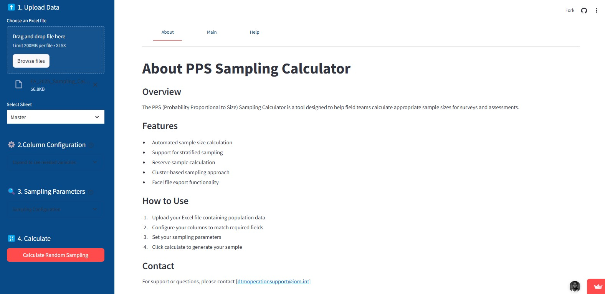

# PPS Sampling Calculator

## Overview
The **PPS Sampling Calculator** is a web-based tool built with Streamlit for calculating **Probability Proportional to Size (PPS)** sampling for survey data. This tool allows users to upload survey data, configure sampling parameters, and generate sample selections using stratified sampling techniques. It provides an intuitive interface for statistical calculations and data visualization.



## Features
- **Upload Excel File**: Accepts Excel files containing survey data.
- **Automatic Sheet Selection**: Detects available sheets in the uploaded file.
- **Custom Column Configuration**: Users can select columns for **site name, site ID, households, Admin3, and strata**.
- **Sampling Calculations**: Computes sample sizes based on confidence level, margin of error, probability, and design effect.
- **Random Sampling**: Generates random numbers for selecting clusters.
- **Visualization**: Displays metrics and summary statistics.
- **Downloadable Results**: Allows users to download sampling results as an Excel file.

## Installation
To run this project locally, follow these steps:

1. **Clone the Repository**
   ```bash
   git clone https://github.com/your-repo/pps-sampling-calculator.git
   cd pps-sampling-calculator
   ```
2. **Create a Virtual Environment (Optional but Recommended)**
   ```bash
   python -m venv env
   source env/bin/activate  # On macOS/Linux
   env\Scripts\activate  # On Windows
   ```
3. **Install Dependencies**
   ```bash
   pip install -r requirements.txt
   ```
4. **Run the Streamlit App**
   ```bash
   streamlit run app.py
   ```

## Dependencies
The following Python libraries are required:
```bash
streamlit
pandas
numpy
scipy
openpyxl
datetime
```
Install them using:
```bash
pip install streamlit pandas numpy scipy openpyxl
```

## How to Use
1. **Upload an Excel file**: Use the sidebar to upload an Excel file with survey data.
2. **Select the appropriate sheet**: Choose the sheet containing the dataset.
3. **Configure column selections**: Assign columns for site names, households, Admin3, and strata.
4. **Set sampling parameters**: Adjust confidence level, margin of error, design effect, and reserve percentage.
5. **Generate Sample**: Click the **Calculate Random Sampling** button to compute the required sample size.
6. **View results**: Explore the summary statistics, grouped data, and selected samples.
7. **Download output**: Export the generated sample selections as an Excel file.

## Output
The application generates an Excel file with:
- **Grouped Data**: Aggregated results based on sampling selection.
- **Sample Data**: The calculated sample per stratum.


## Future Improvements
- **Enhancing Performance**: Optimize calculations for large datasets.
- **Optimize for Multiple Strata**: Optimize output for multiple strata.
- **Multi-Strata Configuration**: Further improvements to allow users to configure and compare multiple strata in more detail.
- **User Authentication**: Implement user login and saved settings.
- **Expanded File Support**: Support CSV and JSON data formats.
- **Integration with Other Tools**: Integrate with other tools like R or Python libraries for more advanced


