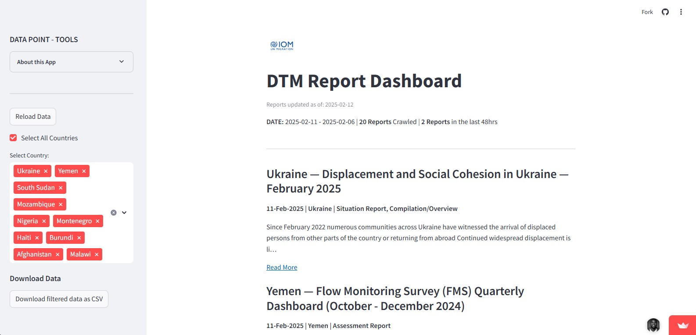

# DTM Report Dashboard (Streamlit App)

## Overview
The **DTM Report Dashboard** is a Streamlit web application designed to scrape, display, and filter reports published by the **IOM Displacement Tracking Matrix (DTM)**. The dashboard allows users to interactively explore reports, filter by country, and download filtered data as a CSV file.



### Live Demo
Access the live version here: [DTM Report Dashboard (Streamlit App)
](https://dtm-data-point.streamlit.app/)

---

## Features
- **Automated Web Scraping:** Fetches reports dynamically from the [DTM website](https://dtm.iom.int/reports).
- **Date-Based Filtering:** Allows users to filter reports based on the last 48 hours.
- **Country-Based Filtering:** Enables selection of specific countries to refine the displayed reports.
- **Interactive UI:** Uses Streamlit widgets for an intuitive experience.
- **Download Functionality:** Allows exporting of filtered data as a CSV file.
- **Caching for Performance:** Uses `st.cache_data()` to optimize data loading speed.

---

## Installation & Setup

### Prerequisites
Ensure that you have Python installed along with the required libraries:
- [Python 3.8+](https://www.python.org/)
- [Streamlit](https://streamlit.io/)

### Required Packages
Install the necessary dependencies before running the application:
```bash
pip install streamlit pandas requests beautifulsoup4 lxml
```

### Running the Application
To run the Streamlit app locally, navigate to the project folder and execute:
```bash
streamlit run app.py
```

---

## Application Structure
```
DTM_Report_Dashboard/
│-- app.py                # Main Streamlit app script
│-- requirements.txt      # Python package dependencies
│-- data/                 # Folder for any static data (if applicable)
│-- assets/               # Images and logos (e.g., IOM logo)
```

---

## Functionality Details

### 1. **Web Scraping (`scrape_data_new`)**
- Fetches reports from the [DTM Reports Page](https://dtm.iom.int/reports).
- Extracts details including:
  - Report Title
  - Summary
  - Published Date
  - Country & Region
  - Report Type
  - Report Link
- Uses `requests` and `BeautifulSoup` for HTML parsing.
- Converts extracted data into a Pandas DataFrame.

### 2. **User Interface (UI)**
- **Sidebar Panel:**
  - Displays filtering options for country selection.
  - Provides an option to reload the data.
  - Allows downloading of filtered reports in CSV format.
- **Main Panel:**
  - Displays key summary statistics such as the number of reports fetched.
  - Lists reports with relevant details.
  - Provides a "Read More" link for each report.

### 3. **Server Logic & Performance Optimization**
- Uses **`st.cache_data()`** to store previously fetched data, reducing redundant requests.
- Implements **`st.experimental_rerun()`** to refresh the dashboard when needed.
- Handles **missing values** gracefully (e.g., missing publication dates).

---

## Deployment
To deploy this app on **Streamlit Community Cloud**, follow these steps:
1. Push your code to a GitHub repository.
2. Go to [Streamlit Cloud](https://share.streamlit.io/).
3. Connect your GitHub repository and deploy the `app.py` script.

Alternatively, deploy using **Docker**:
```dockerfile
# Dockerfile
FROM python:3.8
WORKDIR /app
COPY requirements.txt ./
RUN pip install -r requirements.txt
COPY . .
CMD ["streamlit", "run", "app.py", "--server.port=8501", "--server.address=0.0.0.0"]
```
Then build and run the container:
```bash
docker build -t dtm-report-dashboard .
docker run -p 8501:8501 dtm-report-dashboard
```

---

## Future Improvements
- Implement **real-time API integration** instead of web scraping.
- Enhance **data visualizations** with charts and interactive graphs.
- Improve **error handling** for edge cases in data extraction.
- Add **user authentication** for restricted access.

---

## Contact & Support
For any queries or issues, feel free to reach out via [DTM Contact Page](https://dtm.iom.int/contact).

---

## License
This project is licensed under the MIT License.

---

## Acknowledgments
- **IOM DTM** for their open-access reports.
- **Streamlit & Pandas** for making data visualization seamless.
- **BeautifulSoup** for its efficient web scraping capabilities.

